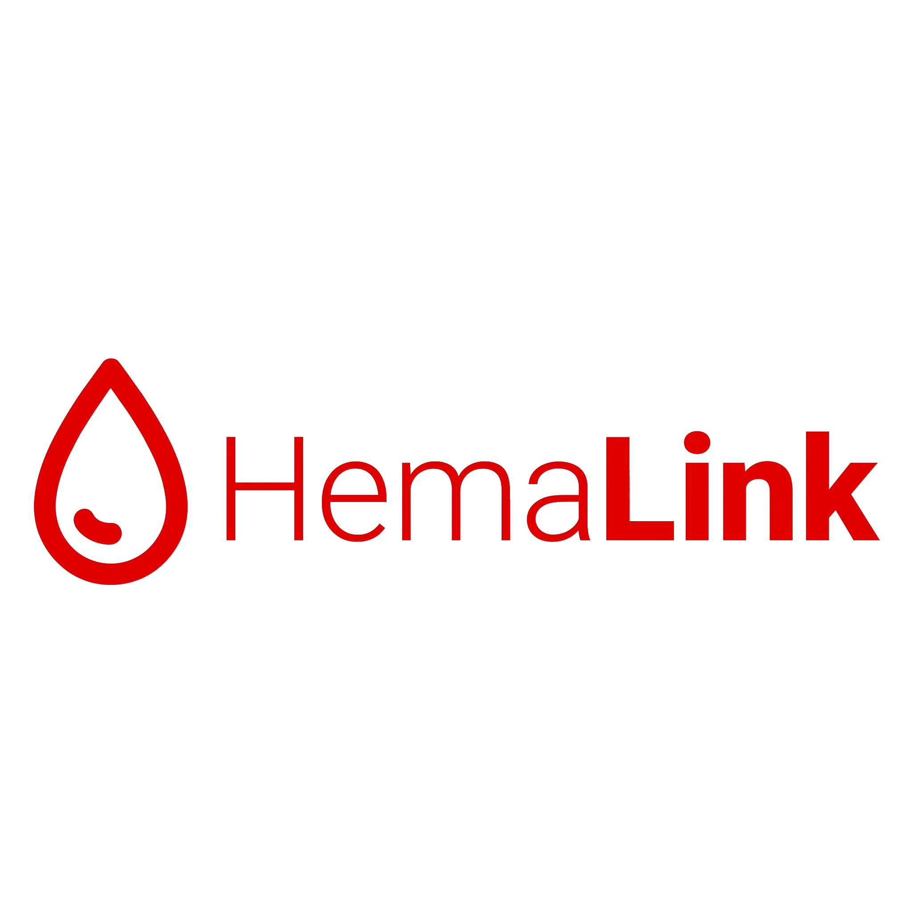

<p align="center">
  
</p>

HemaLink is a frontend web platform for connecting blood requests with hospitals, donors, and partner institutions. It is being developed for Alkhidmat Foundation.

The project currently contains three separate role-based portals:

- **Admin Portal**: platform approvals, request moderation, safety review, and metrics.
- **Hospital Portal**: facility-specific request verification.
- **Partner Institution Portal**: external blood fulfillment, institution requests, and fulfillment history.

## Project Status

The frontend is implemented as a browser-only demo using mock data and localStorage. It is ready for backend integration. Authentication, persistence, notifications, and data mutations are currently simulated on the client.

## Technology

- React
- TypeScript
- Vite
- Tailwind CSS
- React Router
- Lucide React

## Requirements

- Node.js 18 or later
- npm

## Getting Started

From the project root:

```bash
cd frontend
npm install
npm run dev
```

Open the local URL shown by Vite, usually `http://localhost:5173`.

## Available Commands

Run these commands from the `frontend` directory:

```bash
npm run dev       # Start the development server
npm run build     # Type-check and create a production build
npm run lint      # Run ESLint
npm run preview   # Preview the production build
```

## Demo Accounts

These accounts are for local frontend demonstration only.

| Portal | Email | Password |
| --- | --- | --- |
| Admin | `sara@hemalink.org` | `Admin@123` |
| Central City Hospital | `hamza@centralcityhospital.org` | `Hospital@123` |
| Alkhidmat Welfare Centre | `ayesha@alkhidmat.org` | `Partner@123` |

Production authentication must replace these mock credentials.

## Portal Routes

- `/` - Portal selection
- `/admin/login` - Admin login
- `/admin` - Admin overview
- `/hospital/login` - Hospital login
- `/hospital` - Hospital overview
- `/partner/login` - Partner institution login
- `/partner` - Partner overview

Additional workflow routes are documented in the project files and available through each portal's sidebar.

## Core Rules

- Hospitals can verify requests only for their registered facility.
- Hospitals cannot fulfill requests or manage stock.
- Partner institutions can fulfill external blood requests and create requests for their own blood banks.
- A partner's own requests appear under **My requests**, not **Blood requests**.
- **History** contains externally fulfilled requests attributed to the partner institution.
- Requester and donor phone numbers are masked by default.
- A request is fulfilled only when all required units are completed and the fulfillment is confirmed.

## Repository Structure

```text
docs/       Product requirements, architecture, design rules, wireframes, and handoff notes
frontend/   React and TypeScript application
```

Important documentation:

- `docs/PRD.md` - Product requirements and screen inventory
- `docs/rules.md` - Domain and implementation rules
- `docs/architecture.md` - Technical structure and interfaces
- `docs/design.md` - Visual design system
- `docs/frontend-backend-handoff.md` - Backend integration contracts
- `docs/wireframe.penpot` - Product wireframes

## Backend Handoff

The frontend state layer currently uses mock collections and localStorage. Backend integration should replace that adapter with authenticated API queries and mutations while preserving the existing routes, role boundaries, lifecycle rules, and TypeScript domain contracts.

See `docs/frontend-backend-handoff.md` for the expected entities, permissions, request lifecycle, fulfillment flow, privacy requirements, and integration checklist.
